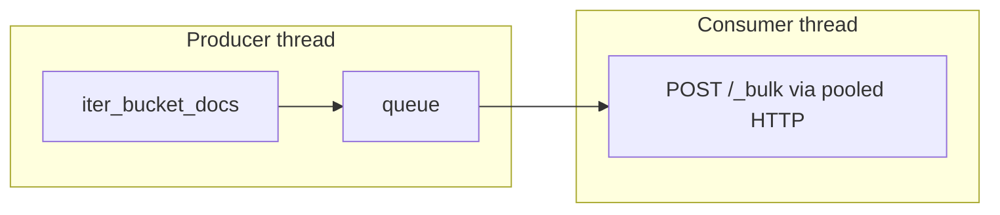

# Frosty

Decode Splunk frozen `journal.zst` buckets and bulk-ingest events into Elasticsearch.

Frosty reads Splunk's on-disk frozen bucket layout, decodes the binary journal format in pure Python, classifies events (access logs, syslog, AWS CloudTrail, VPC flow logs, and generic), and ships them to Elasticsearch with ingest pipelines and programmatic or HTTP-based orchestration.

## Features

- **Pure-Python journal decoder** — no Rust extensions or external Splunk tools required
- **Event classification** — detects access logs, syslog, AWS CloudTrail, VPC flow logs, and generic events per bucket
- **Ingest pipelines** — deploys GROK, JSON, and dissect parsers plus per-index router pipelines automatically
- **Parallel ingest** — process multiple buckets concurrently with SQLite checkpointing for resume
- **Decode/bulk pipeline** — optional overlap of journal decode and Elasticsearch bulk flush (off by default)
- **Three interfaces** — CLI, Python SDK (`FrostyClient`), and FastAPI HTTP service
- **Docker** — containerized API with read-only frozen-data mount and persistent checkpoints
- **Scheduled sync** — hourly cron script deploys pipelines and ingests new buckets via the HTTP API
- **Prometheus metrics** — journal decode, ingest, and API job counters/histograms (`GET /metrics`, optional auth)
- **Elasticsearch remote write** — API pushes metrics every 15s; CLI pushes once after each ingest
- **API authentication** — separate keys for `/v1/*` routes and `/metrics` scraping
- **Journal decode observability** — per-bucket file size, decode time, CPU, and memory (`psutil`)
- **Elastic APM** — optional request, job, and decode-metric tracing via the HTTP service

## Requirements

- Python 3.10+
- Elasticsearch 8.x / 9.x (tested with Elastic Cloud Serverless and Observability projects)
- Splunk frozen buckets on disk (`journal.zst` under `rawdata/`)
- `psutil` (installed automatically; used for process memory metrics)

## Quick start

### Install

```bash
git clone <repo-url> frosty && cd frosty
python3 -m venv .venv
source .venv/bin/activate
pip install -e .
```

For the HTTP API and APM support:

```bash
pip install -e ".[api]"
```

For running API tests locally:

```bash
pip install -e ".[dev]"
python -m unittest discover -s tests -v
```

### Ingest

```bash
export ELASTIC_API_KEY="your-api-key"

# Preview decode counts (no network calls)
frosty-ingest --dry-run

# Ingest all buckets
frosty-ingest

# Ingest one Splunk index
frosty-ingest --index apache

# Force re-ingest (clears checkpoint; does not delete existing ES documents)
frosty-ingest --force --workers 2
```

Use `--force` to clear the Frosty checkpoint and re-process every bucket. To avoid duplicate documents in Elasticsearch, delete the `frosty-*` indices in Kibana before a full re-ingest.

### Ingest iterations

Each ingest run uses a **versioned iteration** starting at `1.0`, auto-incrementing by **0.1** on each consecutive run (`1.0` → `1.1` → … → `1.9` → `2.0`). The next value is persisted at `{checkpoint_base}/.frosty-iteration-next`.

- Writes to timestamped indices (`frosty-apache-1.0-{YYYYMMDDHHMMSS}`)
- Uses an isolated checkpoint at `{checkpoint_base}/iter-1.0/.frosty-checkpoint.db`
- Leaves prior iterations untouched in Elasticsearch

```bash
# Auto iteration (claims 1.0, then 1.1, …)
frosty-ingest --workers 2

# Pin a specific iteration without advancing the counter
frosty-ingest --iteration 2.5 --workers 2

# API — auto increment (requires X-API-Key when FROSTY_API_KEY is set)
curl -X POST http://localhost:8099/v1/jobs/ingest \
  -H "Content-Type: application/json" \
  -H "X-API-Key: ${FROSTY_API_KEY}" \
  -d '{"workers": 2, "resume": true}'

# Starting value when no state file exists (default 1.0)
FROSTY_INGEST_ITERATION=1.0 docker compose up -d
```

Check the next iteration via `GET /health` (`ingest_iteration`, `ingest_iteration_initial`).

### Deploy pipelines

Pipelines are deployed automatically during ingest (`frosty-ingest` and `POST /v1/jobs/ingest` scan journals, create parser pipelines, and set each index's default pipeline before bulk indexing). You can also manage them directly:

```bash
# Preview detected event kinds per index (no Elasticsearch calls)
frosty-setup-pipelines --scan-only

# Deploy or refresh pipelines for all indices
frosty-setup-pipelines

# Re-run existing documents through the router pipeline
frosty-setup-pipelines --reindex
```

Use `frosty-setup-pipelines` when you need to refresh pipelines without ingesting, or `--reindex` to parse documents that were indexed before pipelines existed. The `--reindex` flag runs `_update_by_query` with the router pipeline — it does not delete or recreate indices.

## Splunk frozen bucket layout

Frosty expects the standard Splunk frozen directory structure:

```
frozen/
  apache/                          # Splunk index name
    db_1778817368_1778790392_0/    # bucket: db_{latest}_{earliest}_{seq}
      rawdata/
        journal.zst
  nginx/
  syslog/
  cloud_trail/                     # AWS CloudTrail (aws:cloudtrail)
  vpc_flowlogs/                    # AWS VPC Flow Logs (aws:cloudwatchlogs:vpcflow)
```

Point frosty at the root `frozen/` directory. Each index subdirectory contains one or more bucket folders with a `rawdata/journal.zst` file.

## CLI reference

### `frosty-ingest`

Decode journals and bulk-index into Elasticsearch (`frosty-{index}-{iteration}-{timestamp}`).

| Flag | Default | Description |
|------|---------|-------------|
| `--frozen-dir` | `$FROSTY_FROZEN_DIR` or `/Users/klg/Desktop/frozen` | Root folder with index subdirectories |
| `--elastic-url` | `$ELASTIC_URL` | Elasticsearch endpoint |
| `--api-key` | `$ELASTIC_API_KEY` | API key for authentication |
| `--index` | all | Filter to one Splunk index (repeatable) |
| `--bucket` | all | Filter to one bucket directory name (repeatable) |
| `--batch-size` | `500` | Bulk API batch size |
| `--workers` | `4` (`FROSTY_INGEST_WORKERS`) | Parallel bucket ingest workers |
| `--checkpoint` | `<frozen-dir>/.frosty-checkpoint.db` | Resume state database |
| `--no-resume` | off | Re-ingest buckets even if checkpointed complete |
| `--force` | off | Clear checkpoint and re-ingest all |
| `--ingest-iteration`, `--iteration` | auto (+0.1/run) | Explicit version (e.g. `1.0`); otherwise auto from state file |
| `--index-timestamp` | auto at ingest start | Fixed UTC timestamp (`YYYYMMDDHHMMSS`) for index names |
| `--index-suffix` | — | Deprecated: overrides iteration number in index names |
| `--dry-run` | off | Decode and count events without sending |
| `--skip-index-create` | off | Skip automatic index creation |

### `frosty-setup-pipelines`

Scan journals, deploy parser pipelines for detected event kinds, and attach router pipelines to indices.

| Flag | Default | Description |
|------|---------|-------------|
| `--frozen-dir` | `$FROSTY_FROZEN_DIR` | Root folder with index subdirectories |
| `--elastic-url` | `$ELASTIC_URL` | Elasticsearch endpoint |
| `--api-key` | `$ELASTIC_API_KEY` | API key for authentication |
| `--index` | all | Filter to one Splunk index (repeatable) |
| `--scan-only` | off | Print detected event kinds without deploying |
| `--write-json` | off | Write pipeline JSON to `pipelines/` |
| `--reindex` | off | Re-run existing documents through the router pipeline (`_update_by_query`) |
| `--skip-default-pipeline` | off | Deploy pipelines but don't set index default |

## Python SDK

```python
from frosty import FrostyClient, FrostyConfig

client = FrostyClient(FrostyConfig(
    frozen_dir="/path/to/frozen",
    api_key="...",
))

# List discovered buckets
buckets = client.list_buckets(indices=["apache"])

# Scan event kinds per index
scan = client.scan()
for profile in scan.indices:
    print(profile.index_name, profile.event_kinds)

# Dry-run decode counts
dry_run = client.dry_run(indices=["apache"])
print(dry_run.total_events)

# Ingest with parallel workers and resume
result = client.ingest(workers=4, resume=True)
print(result.total_indexed, result.skipped)

# New code iteration — separate indices and checkpoint
iter_client = FrostyClient(client.config.for_iteration("2.0"))
result = iter_client.ingest(workers=2, resume=True)
print(result.metrics.total_decode_duration_ms)

# Full reset (checkpoint only — delete frosty-* indices first to avoid duplicates)
result = client.ingest(force=True, resume=False, workers=2)

# Deploy detected pipelines
client.setup_pipelines(reindex=True)

# Decode without Elasticsearch
for doc in client.decode_bucket(buckets[0]):
    print(doc["message"])
```

### Key modules

| Module | Purpose |
|--------|---------|
| `frosty.client` | `FrostyClient` — high-level scan, ingest, pipeline setup |
| `frosty.buckets` | Discover frozen bucket directories |
| `frosty.journal` | Decode journals into Elasticsearch documents |
| `frosty.event_types` | Event classification (`access_log`, `syslog`, `cloud_trail`, `vpc_flow`, `generic`) |
| `frosty.pipelines` | Ingest pipeline definitions |
| `frosty.elastic` | Elasticsearch bulk, index, and pipeline operations |
| `frosty.checkpoint` | SQLite resume state |
| `frosty.metrics` | Prometheus metrics, journal decode timing, API job counters |
| `frosty.prometheus_remote` | Elasticsearch Prometheus remote write pusher |
| `frosty.api` | FastAPI HTTP service (`frosty.api.auth` for API/metrics keys) |

## HTTP API

Install API dependencies, set credentials, and start the service:

```bash
pip install -e ".[api]"
cp .env.example .env
# Edit .env — set ELASTIC_API_KEY, FROSTY_API_KEY, and FROSTY_METRICS_API_KEY

export ELASTIC_API_KEY="your-es-api-key"
export FROSTY_API_KEY="your-api-key"
export FROSTY_METRICS_API_KEY="your-metrics-scrape-key"
export FROSTY_REQUIRE_API_KEY=true

frosty-api
```

For APM tracing, also set `ELASTIC_APM_SERVER_URL` and `ELASTIC_APM_API_KEY` — see [Elastic APM](#elastic-apm).

Interactive docs are available at `http://localhost:${FROSTY_API_PORT:-8080}/docs` (disable with `FROSTY_DISABLE_DOCS=true`).

### Authentication

Frosty uses two optional shared secrets, both sent via the `X-API-Key` header:

| Credential | Env var | Protects |
|------------|---------|----------|
| API key | `FROSTY_API_KEY` | All `/v1/*` routes |
| Metrics key | `FROSTY_METRICS_API_KEY` | `GET /metrics` only |

**Production (recommended):** set `FROSTY_REQUIRE_API_KEY=true`. The service refuses to start if `FROSTY_API_KEY` is unset. Docker Compose enables this by default.

**Development:** leave `FROSTY_REQUIRE_API_KEY` unset and omit `FROSTY_API_KEY` to allow unauthenticated `/v1/*` access. `/metrics` remains open until `FROSTY_METRICS_API_KEY` is set.

Key comparison uses constant-time `secrets.compare_digest`.

**Failed jobs** return `error` (message string) but never include Python tracebacks in the JSON response. Full stack traces are logged server-side only.

**`GET /v1/jobs`** accepts `limit` (1–500, default 50).

### Endpoints

| Method | Path | Auth | Description |
|--------|------|------|-------------|
| `GET` | `/health` | — | Service health, version, Elastic/APM/remote-write status |
| `GET` | `/metrics` | metrics key | Prometheus scrape endpoint |
| `GET` | `/v1/buckets` | API key | List discovered frozen buckets |
| `POST` | `/v1/jobs/scan` | API key | Background event-kind scan |
| `POST` | `/v1/jobs/dry-run` | API key | Background decode/count |
| `POST` | `/v1/jobs/ingest` | API key | Background ingest to Elasticsearch |
| `POST` | `/v1/jobs/pipelines/setup` | API key | Deploy/reindex pipelines |
| `GET` | `/v1/jobs` | API key | List recent jobs |
| `GET` | `/v1/jobs/{job_id}` | API key | Poll job status and result |
| `POST` | `/v1/elastic/verify` | API key | Verify Elasticsearch connectivity |

Set `FROSTY_REQUIRE_API_KEY=true` (recommended in production) to require `FROSTY_API_KEY` at startup and on all `/v1/*` routes via the `X-API-Key` header.

`GET /metrics` uses a separate `FROSTY_METRICS_API_KEY` when set (same `X-API-Key` header) so Prometheus scrapers can use a dedicated credential with narrower scope.

`GET /health` is always unauthenticated and reports `prometheus_remote_write_enabled` when remote write is configured.

Long-running operations return `202 Accepted` with a `job_id`. Poll `GET /v1/jobs/{job_id}` until `status` is `completed` or `failed`.

### Example requests

```bash
PORT=${FROSTY_API_PORT:-8080}

curl "http://localhost:${PORT}/health"

curl -H "X-API-Key: ${FROSTY_METRICS_API_KEY}" "http://localhost:${PORT}/metrics"

curl -H "X-API-Key: ${FROSTY_API_KEY}" "http://localhost:${PORT}/v1/buckets"

curl -X POST "http://localhost:${PORT}/v1/jobs/ingest" \
  -H "Content-Type: application/json" \
  -H "X-API-Key: ${FROSTY_API_KEY}" \
  -d '{"workers": 2, "resume": true}'

# Full reset and re-ingest all buckets
curl -X POST "http://localhost:${PORT}/v1/jobs/ingest" \
  -H "Content-Type: application/json" \
  -H "X-API-Key: ${FROSTY_API_KEY}" \
  -d '{"force": true, "resume": false, "workers": 2}'

curl -X POST "http://localhost:${PORT}/v1/jobs/pipelines/setup" \
  -H "Content-Type: application/json" \
  -H "X-API-Key: ${FROSTY_API_KEY}" \
  -d '{"indices": ["cloud_trail"], "set_default": true, "reindex": true}'

curl -H "X-API-Key: ${FROSTY_API_KEY}" "http://localhost:${PORT}/v1/jobs/{job_id}"

curl -X POST -H "X-API-Key: ${FROSTY_API_KEY}" "http://localhost:${PORT}/v1/elastic/verify"
```

## Docker

```bash
cp .env.example .env
# Edit .env — set ELASTIC_API_KEY, FROSTY_API_KEY, FROSTY_METRICS_API_KEY (see below)

docker compose up --build -d
curl http://localhost:${FROSTY_API_PORT:-8080}/health
docker compose logs -f
```

Example `.env` for production-style deployment:

```bash
FROSTY_FROZEN_DIR=/Users/klg/Desktop/frozen
FROSTY_API_PORT=8099

# Required in Docker Compose (FROSTY_REQUIRE_API_KEY=true)
FROSTY_API_KEY=your-frosty-api-key
FROSTY_METRICS_API_KEY=your-prometheus-scrape-key

ELASTIC_URL=https://klgfrostydev-f84e40.es.us-central1.gcp.elastic.cloud:443
ELASTIC_API_KEY=your-es-api-key

# In-process workers (no docker.sock mount required)
FROSTY_CONTAINER_WORKERS=false

ELASTIC_APM_SERVER_URL=https://klgfrostydev-f84e40.apm.us-central1.gcp.elastic.cloud
ELASTIC_APM_API_KEY=your-apm-agent-api-key
```

### Onboard frozen data

Initial load or full reset from the host (with the container running):

```bash
docker exec frosty-frosty-api-1 python3 -c "
from frosty.client import FrostyClient
from frosty.config import FrostyConfig
c = FrostyClient(FrostyConfig())
c.clear_checkpoint()
c.setup_pipelines(set_default=True)
r = c.ingest(force=True, resume=False, workers=2)
print(r.total_indexed, 'indexed,', r.failed, 'failed')
"
```

Or via the API (requires `X-API-Key` when `FROSTY_API_KEY` is set):

```bash
curl -X POST "http://localhost:${FROSTY_API_PORT:-8099}/v1/jobs/pipelines/setup" \
  -H "Content-Type: application/json" \
  -H "X-API-Key: ${FROSTY_API_KEY}" \
  -d '{"set_default": true}'

curl -X POST "http://localhost:${FROSTY_API_PORT:-8099}/v1/jobs/ingest" \
  -H "Content-Type: application/json" \
  -H "X-API-Key: ${FROSTY_API_KEY}" \
  -d '{"force": true, "resume": false, "workers": 2}'
```

Documents land in `frosty-{index}-{iteration}-{timestamp}` indices (e.g. `frosty-apache-1-20250710120000`).

The container:

- Mounts frozen buckets read-only at `/data/frozen`
- Persists checkpoint state in a Docker volume at `/data/checkpoint`
- Exposes port **8080** by default (`FROSTY_API_PORT` in `.env` maps host → container)
- Health-checks `GET /health` and runs as the non-root `frosty` user
- Uses in-process parallel workers by default (`FROSTY_CONTAINER_WORKERS=false`) — no Docker socket mount

Ingest is **on-demand** — the API does not watch the frozen directory. New `journal.zst` buckets are visible immediately via `GET /v1/buckets`, but nothing is sent to Elasticsearch until you POST `/v1/jobs/ingest` (or use the CLI). Each ingest job also deploys pipelines for the indices being processed. For hands-off operation, set up the hourly cron job below.

If port 8080 is already in use on the host, set `FROSTY_API_PORT=8099` (or another free port) in `.env` before starting.

### Hourly sync (cron)

`scripts/hourly-ingest.sh` keeps pipelines and ingest in sync with the frozen directory:

Install (merges with your existing crontab — use an absolute path):

```bash
chmod +x scripts/hourly-ingest.sh

REPO=/path/to/frosty   # e.g. /Users/you/frosty
( crontab -l 2>/dev/null | grep -v 'frosty/scripts/hourly-ingest.sh'; \
  echo "0 * * * * ${REPO}/scripts/hourly-ingest.sh >> ${REPO}/logs/hourly-ingest.log 2>&1" \
) | crontab -
```

The script sources `.env` for `FROSTY_API_PORT` and `FROSTY_API_KEY` (required when `FROSTY_REQUIRE_API_KEY=true`), verifies `/health`, then:

1. Runs `POST /v1/jobs/pipelines/setup` and waits for completion (deploys parsers and sets index default pipelines)
2. Submits `POST /v1/jobs/ingest` with `resume: true` (skips buckets already in the checkpoint)

Override paths with `FROSTY_ENV_FILE` or `FROSTY_LOG_DIR`. Tune job polling with `FROSTY_JOB_WAIT_SECONDS` (default `600`) and `FROSTY_JOB_POLL_SECONDS` (default `5`).

Verify and monitor:

```bash
./scripts/hourly-ingest.sh
tail -f logs/hourly-ingest.log

# Poll the submitted job (use job_id from the log line)
curl -H "X-API-Key: ${FROSTY_API_KEY}" \
  "http://localhost:${FROSTY_API_PORT:-8080}/v1/jobs?limit=5"
```

Remove the schedule:

```bash
crontab -l | grep -v 'frosty/scripts/hourly-ingest.sh' | crontab -
```

Standalone run:

```bash
docker build -t frosty-api .

docker run --rm -p 8080:8080 \
  -v /path/to/frozen:/data/frozen:ro \
  -e FROSTY_REQUIRE_API_KEY=true \
  -e FROSTY_API_KEY="your-api-key" \
  -e FROSTY_METRICS_API_KEY="your-metrics-key" \
  -e ELASTIC_API_KEY="your-es-api-key" \
  -e ELASTIC_APM_SERVER_URL="https://your-deployment.apm.region.gcp.elastic.cloud" \
  -e ELASTIC_APM_API_KEY="your-apm-agent-api-key" \
  frosty-api
```

To use isolated Docker worker containers on bare metal (not recommended inside the Compose service), set `FROSTY_CONTAINER_WORKERS=true` and ensure the host can run `docker` — this requires mounting `/var/run/docker.sock` and is not used by default in `docker-compose.yml`.

## Elastic APM

The HTTP service sends request traces to Elastic APM when configured. On **Observability** projects you typically use:

- `ELASTIC_API_KEY` — bulk ingest, pipelines, and index management
- `ELASTIC_APM_API_KEY` — APM trace intake (a dedicated agent key is recommended)

| Credential | Used for | Where to get it |
|------------|----------|-----------------|
| `ELASTIC_API_KEY` | Bulk ingest, pipelines, index management | Elasticsearch / project API keys |
| `ELASTIC_APM_API_KEY` | APM trace intake | Kibana → **Applications** → **Settings** → **Agent keys** |
| `ELASTIC_APM_SECRET_TOKEN` | APM trace intake (alternative) | Elastic Cloud Console → deployment → **APM & Fleet** |

Create an APM agent key with at least the **`event:write`** privilege. The value should be a base64-encoded string (typically starting with characters like `OGta...` or `SHZU...`), not an `essu_` Cloud management key.

Example `.env` entries:

```bash
ELASTIC_URL=https://klgfrostydev-f84e40.es.us-central1.gcp.elastic.cloud:443
ELASTIC_API_KEY=your-es-api-key

ELASTIC_APM_SERVER_URL=https://klgfrostydev-f84e40.apm.us-central1.gcp.elastic.cloud
ELASTIC_APM_API_KEY=your-apm-agent-api-key
ELASTIC_APM_SERVICE_NAME=frosty-api
ELASTIC_APM_ENVIRONMENT=production
```

Verify APM is working:

```bash
curl "http://localhost:${FROSTY_API_PORT:-8080}/health"
# expect: "apm_enabled": true, "prometheus_remote_write_enabled": true (when configured)

# check container logs — there should be no "HTTP 401: Unauthenticated" errors
docker compose logs -f
```

Traces appear in Kibana under **Observability → APM → Services → frosty-api**.

### APM troubleshooting

| Symptom | Cause | Fix |
|---------|-------|-----|
| `apm_enabled: false` | Missing or invalid APM credentials | Set `ELASTIC_APM_API_KEY` or `ELASTIC_APM_SECRET_TOKEN` |
| `HTTP 401` on ingest | Wrong or expired `ELASTIC_API_KEY` | Create a new API key for the target project |
| `HTTP 401: illegal base64` | Wrong key format (e.g. `essu_` Cloud API key) | Use an APM agent key from Kibana **Agent keys** |
| `HTTP 401: Unauthenticated` (APM) | Key lacks APM privileges or wrong deployment | Recreate key with `event:write`; confirm `ELASTIC_APM_SERVER_URL` matches your project |
| `Remote end closed connection without response` | HTTP keep-alive race on metrics flush (~30s) | Default fix: `ELASTIC_APM_METRICS_INTERVAL=25s` (set automatically); increase if it persists |

Frosty normalizes `essu_`-prefixed keys when possible, but those keys are for the Elastic Cloud REST API and generally will not work for APM intake. Use an APM agent key or secret token instead.

## Configuration

All settings are driven by environment variables:

| Variable | Default | Description |
|----------|---------|-------------|
| `FROSTY_FROZEN_DIR` | `/Users/klg/Desktop/frozen` | Splunk frozen bucket root |
| `FROSTY_INGEST_ITERATION` | `1.0` | Starting iteration when no state file exists; then auto +0.1 per run |
| `FROSTY_INDEX_TIMESTAMP` | auto at ingest start | Fixed UTC timestamp for index names (`YYYYMMDDHHMMSS`) |
| `FROSTY_INDEX_SUFFIX` | — | Deprecated: overrides iteration segment when iteration is unset |
| `FROSTY_CHECKPOINT_PATH` | `<frozen-dir>/.frosty-checkpoint.db` | Resume checkpoint database |
| `ELASTIC_URL` | `https://klgfrostydev-f84e40.es.us-central1.gcp.elastic.cloud:443` | Elasticsearch URL |
| `ELASTIC_API_KEY` | — | Elasticsearch API key |
| `FROSTY_API_HOST` | `0.0.0.0` | HTTP bind address |
| `FROSTY_API_PORT` | `8080` | HTTP listen port |
| `FROSTY_API_KEY` | — | API key for `/v1/*` routes (`X-API-Key` header) |
| `FROSTY_REQUIRE_API_KEY` | `false` | When `true`, startup fails if `FROSTY_API_KEY` is unset |
| `FROSTY_METRICS_API_KEY` | — | Separate key for `GET /metrics` (`X-API-Key` header) |
| `FROSTY_DISABLE_DOCS` | `false` | Set `true` to disable `/docs` and OpenAPI |
| `FROSTY_INGEST_WORKERS` | `4` | Default parallel bucket ingest workers (CLI and API) |
| `FROSTY_CONTAINER_WORKERS` | `true` | Run each worker in its own Docker container when `workers > 1` (set `false` in Docker Compose) |
| `FROSTY_SKIP_METADATA` | `false` | Skip Splunk metadata field extraction during decode |
| `FROSTY_BULK_PIPELINE_ENABLED` | `false` | Overlap journal decode with Elasticsearch bulk flush in a background thread |
| `FROSTY_BULK_PIPELINE_PREFETCH` | `1` | Bulk batches buffered between decode and flush when pipeline is enabled |
| `FROSTY_FROZEN_HOST_DIR` | `FROSTY_FROZEN_DIR` | Host path bind-mounted into worker containers |
| `FROSTY_CHECKPOINT_VOLUME` | — | Docker volume name for checkpoint state in worker containers |
| `FROSTY_WORKER_IMAGE` | `frosty-api:latest` | Image used for ingest worker containers |
| `FROSTY_JOB_WORKERS` | `2` | Background job thread pool size |
| `FROSTY_PROMETHEUS_REMOTE_WRITE_ENABLED` | `true` | Push metrics to Elasticsearch remote write |
| `FROSTY_PROMETHEUS_REMOTE_WRITE_INTERVAL_SECONDS` | `15` | Background push interval for `frosty-api` |
| `FROSTY_PROMETHEUS_REMOTE_WRITE_METRIC_PREFIX` | `frosty_` | Only export metrics with this name prefix (empty = all) |
| `FROSTY_PROMETHEUS_REMOTE_WRITE_TIMEOUT_SECONDS` | `30` | HTTP timeout per remote-write push |
| `ELASTIC_APM_SERVER_URL` | — | APM server URL; enables tracing when auth is also set |
| `ELASTIC_APM_SECRET_TOKEN` | — | APM secret token (Elastic Cloud **APM & Fleet**) |
| `ELASTIC_APM_API_KEY` | — | APM agent key (Kibana **Applications → Agent keys**); not `ELASTIC_API_KEY` |
| `ELASTIC_APM_SERVICE_NAME` | `frosty-api` | Service name in APM |
| `ELASTIC_APM_ENVIRONMENT` | `production` | APM environment tag |

Cron script overrides (optional):

| Variable | Default | Description |
|----------|---------|-------------|
| `FROSTY_ENV_FILE` | `<repo>/.env` | Env file sourced by `scripts/hourly-ingest.sh` |
| `FROSTY_LOG_DIR` | `<repo>/logs` | Directory for `hourly-ingest.log` |
| `FROSTY_JOB_WAIT_SECONDS` | `600` | Max wait for pipeline setup job to finish |
| `FROSTY_JOB_POLL_SECONDS` | `5` | Poll interval when waiting on jobs |

## Performance tuning

Frosty includes several ingest optimizations. Most are enabled automatically; the decode/bulk pipeline is opt-in.

| Optimization | Status | Notes |
|--------------|--------|-------|
| HTTP connection pooling | Always on | Elasticsearch requests reuse pooled `urllib3` connections (`elastic.py`) |
| Latin-1 text decode fast path | Always on | Used for apache/nginx/syslog/vpc_flowlogs and matching sourcetypes (`text_decode.py`) |
| Bucket-level parallelism | Configurable | `FROSTY_INGEST_WORKERS`, `FROSTY_CONTAINER_WORKERS`, `FROSTY_PARTITION_STRATEGY` |
| Decode/bulk pipeline overlap | **Off by default** | Set `FROSTY_BULK_PIPELINE_ENABLED=true` to enable |

### Decode/bulk pipeline overlap

By default, each bucket is decoded and bulk-indexed sequentially in one thread: while Elasticsearch flushes a batch, journal decode is idle, and vice versa.

When `FROSTY_BULK_PIPELINE_ENABLED=true`, frosty runs a **producer thread** (journal decode → NDJSON batch lines) and a **consumer thread** (bulk flush to Elasticsearch) connected by a bounded queue:



- `FROSTY_BULK_PIPELINE_PREFETCH` (default `1`) controls how many bulk batches can be buffered ahead of the flush thread
- Higher prefetch can improve throughput on high-latency Elasticsearch clusters at the cost of more memory (`prefetch × batch_size × avg_doc_size`)
- Errors from either thread fail the bucket ingest; partial batches are not committed after a decode failure

Enable for soak testing on large buckets:

```bash
export FROSTY_BULK_PIPELINE_ENABLED=true
export FROSTY_BULK_PIPELINE_PREFETCH=2
frosty-ingest --workers 4
```

## Elasticsearch documents

Events are indexed into `frosty-{index}-{iteration}-{timestamp}` with:

| Field | Description |
|-------|-------------|
| `@timestamp` | Event time from the journal (ISO-8601 UTC) |
| `message` | Raw log line (Latin-1 fast path for known access/syslog/VPC sources; UTF-8 otherwise) |
| `host`, `source`, `sourcetype` | Splunk metadata (prefixes stripped) |
| `event.kind` | Detected type: `access_log`, `syslog`, `cloud_trail`, `vpc_flow`, or `generic` |
| `event.dataset` | Dataset identifier (e.g. `apache.access_log`) |
| `splunk.index` | Source Splunk index name |
| `splunk.bucket_name` | Bucket directory name |
| `splunk.bucket_latest` | Bucket latest epoch |
| `splunk.bucket_earliest` | Bucket earliest epoch |
| `splunk.index_time` | Splunk index time |
| `splunk.pipeline` | Target parser pipeline name |
| `splunk.classify_reason` | Why this event kind was chosen |

Parsed fields from ingest pipelines (examples):

| Index type | Key fields after pipeline |
|------------|---------------------------|
| `access_log` | `http.request.method`, `http.response.status_code`, `client.ip` |
| `syslog` | `syslog.hostname`, `syslog.program`, `syslog.message` |
| `cloud_trail` | `aws.cloudtrail.eventName`, `aws.cloudtrail.eventSource`, `cloud.account.id` |
| `vpc_flow` | `aws.vpcflow.srcaddr`, `aws.vpcflow.dstaddr`, `aws.vpcflow.action` |

VPC flow fields are stored under `aws.vpcflow.*` (not `source.address`) to avoid colliding with Splunk's `source` metadata field.

## Ingest pipelines

Frosty scans journals to detect event kinds, deploys shared parser pipelines, and attaches a per-index router (`frosty-pipeline-{index}`) as the index default. New documents are parsed on ingest; use `--reindex` to backfill documents indexed before pipelines existed.

| Pipeline | Purpose |
|----------|---------|
| `frosty-parse-access-log` | Apache/Nginx combined log format (GROK) |
| `frosty-parse-syslog` | Syslog, sshd, sudo patterns (GROK) |
| `frosty-parse-cloud-trail` | AWS CloudTrail JSON events |
| `frosty-parse-vpc-flow` | AWS VPC Flow Log version 2 (dissect → `aws.vpcflow.*`) |
| `frosty-parse-generic` | Fallback passthrough |
| `frosty-pipeline-{index}` | Per-index router (routes by `event.kind`) |

### Event classification

| Kind | Typical sourcetypes | Detection |
|------|---------------------|-----------|
| `access_log` | `access_*`, `nginx`, `apache` | Sourcetype, source path, or combined-log message pattern |
| `syslog` | `syslog`, `linux_syslog` | Sourcetype, `/var/log/syslog` source, or RFC3164 message prefix |
| `cloud_trail` | `aws:cloudtrail` | Sourcetype or JSON message with `eventVersion` |
| `vpc_flow` | `aws:cloudwatchlogs:vpcflow` | Sourcetype or space-delimited flow-log message pattern |
| `generic` | anything else | Fallback when no pattern matches |

Run `frosty-setup-pipelines --scan-only` to preview which pipelines would be deployed for your data.

## Metrics

Frosty exposes [Prometheus](https://prometheus.io/) metrics on the API service and can push them to Elasticsearch via remote write.

### Prometheus (`GET /metrics`)

Available on the API service (`frosty-api`). When `FROSTY_METRICS_API_KEY` is set, pass it as the `X-API-Key` header:

```bash
curl -s -H "X-API-Key: ${FROSTY_METRICS_API_KEY}" \
  "http://localhost:${FROSTY_API_PORT:-8080}/metrics"
```

Prometheus scrape config with custom header (Prometheus 2.45+):

```yaml
scrape_configs:
  - job_name: frosty
    metrics_path: /metrics
    static_configs:
      - targets: ["frosty-api:8080"]
    http_headers:
      X-API-Key:
        values: ["${FROSTY_METRICS_API_KEY}"]
```

| Metric | Type | Labels | Description |
|--------|------|--------|-------------|
| `frosty_journal_decodes_total` | Counter | `index_name`, `ingest_iteration`, `index_timestamp` | Journal files decoded |
| `frosty_journal_events_decoded_total` | Counter | `index_name`, `ingest_iteration`, `index_timestamp` | Events decoded from journals |
| `frosty_journal_bytes_decoded_total` | Counter | `index_name`, `ingest_iteration`, `index_timestamp` | Bytes of journal.zst decoded |
| `frosty_journal_decode_duration_seconds` | Histogram | `index_name`, `ingest_iteration`, `index_timestamp` | Wall-clock decode time |
| `frosty_journal_size_bytes` | Histogram | `index_name`, `ingest_iteration`, `index_timestamp` | On-disk journal file size |
| `frosty_process_memory_rss_bytes` | Gauge | `index_name`, `ingest_iteration`, `index_timestamp` | Process RSS after most recent decode |
| `frosty_ingest_documents_total` | Counter | `index_name`, `ingest_iteration`, `index_timestamp`, `result` | Documents indexed (`success` / `error`) |
| `frosty_ingest_buckets_total` | Counter | `index_name`, `ingest_iteration`, `index_timestamp`, `status` | Bucket outcomes (`completed`, `failed`, `skipped`) |
| `frosty_bucket_process_cpu_seconds` | Histogram | `index_name`, `ingest_iteration`, `index_timestamp` | Process CPU seconds per bucket (decode + bulk index) |
| `frosty_bucket_process_duration_seconds` | Histogram | `index_name`, `ingest_iteration`, `index_timestamp` | Wall-clock seconds per bucket ingest |
| `frosty_api_jobs_total` | Counter | `job_type`, `status` | API jobs (`submitted`, `running`, `completed`, `failed`) |

### API job metrics

Background jobs increment `frosty_api_jobs_total` on each state transition:

| `status` label | When |
|----------------|------|
| `submitted` | Job accepted into the thread pool |
| `running` | Worker thread started |
| `completed` | Job finished successfully |
| `failed` | Job raised an exception (`error` field set; no traceback in response) |

### APM traces (ingest)

When Elastic APM is enabled, ingest creates a trace hierarchy:

```
frosty.ingest (transaction)
  frosty.ingest_bucket (span)
    frosty.elastic_bulk_write (span)
      frosty.journal_read_decode (span)  # read + decode journal.zst
      frosty.elastic_bulk_flush (span)   # per bulk batch
```

Parallel workers emit one `frosty.ingest_bucket` transaction per bucket (with the same child spans).

### Remote write to Elasticsearch

When `ELASTIC_URL` and `ELASTIC_API_KEY` are set and `FROSTY_PROMETHEUS_REMOTE_WRITE_ENABLED` is not `false`, frosty pushes metrics to Elasticsearch's native Prometheus remote write endpoint:

```
{ELASTIC_URL}/_prometheus/api/v1/write
```

- **API service (`frosty-api`)** — background pusher starts on app startup and stops on shutdown; pushes every 15s by default
- **CLI (`frosty-ingest`)** — one push after each successful ingest run (skipped on `--dry-run`)

The Elasticsearch API key must have write access to `metrics-*` data streams. `GET /health` reports `prometheus_remote_write_enabled: true` when remote write is configured (credentials present and enabled).

Remote-write env vars are listed in [Configuration](#configuration) (`FROSTY_PROMETHEUS_*`).

### Per-bucket job results

Each `journal.zst` decode also records per-bucket fields returned on `IngestResult` and `POST /v1/jobs/ingest`:

| Field | Description |
|-------|-------------|
| `process_cpu_seconds` | Process CPU seconds for the full bucket ingest (decode + bulk index) |
| `process_duration_seconds` | Wall-clock seconds for the full bucket ingest |
| `journal_size_bytes` | On-disk size of the `journal.zst` file |
| `decode_duration_ms` | Wall-clock time to decode the journal (ms) |
| `event_count` | Events decoded from the journal |
| `process_cpu_time_ms` | CPU time consumed by the process during decode (ms) |
| `process_cpu_percent` | CPU utilization during decode (0–100%, single-core equivalent) |
| `process_memory_rss_bytes` | Process RSS after decode |
| `process_memory_percent` | Process memory as % of system RAM (requires `psutil`) |

### Logging

Structured logs at `INFO` (use `frosty-ingest -v` for `DEBUG`):

- `journal_decode` — per-bucket decode timing and resource usage
- `ingest_bucket` — bucket ingest outcome
- `ingest_start` / `ingest_complete` — run-level summaries
- `job_failed` — API background job failures (full traceback in server logs only)
- `prometheus_remote_write` / `prometheus_remote_write_started` / `prometheus_remote_write_stopped` — Elasticsearch remote write lifecycle

When Elastic APM is enabled, decode and ingest metrics include `ingest_iteration`, `index_timestamp`, and combined `ingest_run` (`{iteration}-{timestamp}`) on transactions and spans.

CLI example:

```bash
frosty-ingest --index vpc_flowlogs -v
```

## Journal decoder

Splunk's binary `journal.zst` format is decoded by a vendored pure-Python implementation in `frosty/splunk_journal/`, adapted from:

- [splunk-ddss-extractor](https://github.com/ponquersohn/splunk_ddss_extractor) (MIT)
- [splunker](https://github.com/fionera/splunker) (Apache-2.0)

## Project structure

```
frosty/
  frosty/
    splunk_journal/   # Binary journal decoder
    buckets.py        # Frozen bucket discovery
    journal.py        # Journal → ES document mapping
    event_types.py    # Event classification
    pipelines.py      # Ingest pipeline definitions
    elastic.py        # Elasticsearch client operations
    checkpoint.py     # SQLite resume state
    metrics.py        # Prometheus metrics and journal decode observability
    prometheus_remote.py  # Elasticsearch Prometheus remote write pusher
    client.py         # FrostyClient SDK
    ingest.py         # frosty-ingest CLI
    deploy_pipelines.py  # frosty-setup-pipelines CLI
    api/              # FastAPI service, auth, APM
  tests/
    test_api_phase1.py  # API auth, jobs, remote-write lifespan
    test_phase2.py      # HTTP pooling, text decode, metrics aggregation
    test_phase4.py      # Decode/bulk pipeline overlap
  scripts/
    hourly-ingest.sh  # Cron helper — pipeline setup + resume ingest
  Dockerfile
  docker-compose.yml
  .env.example
  pyproject.toml
```

## License

MIT. See vendored decoder attributions above for third-party licenses.
